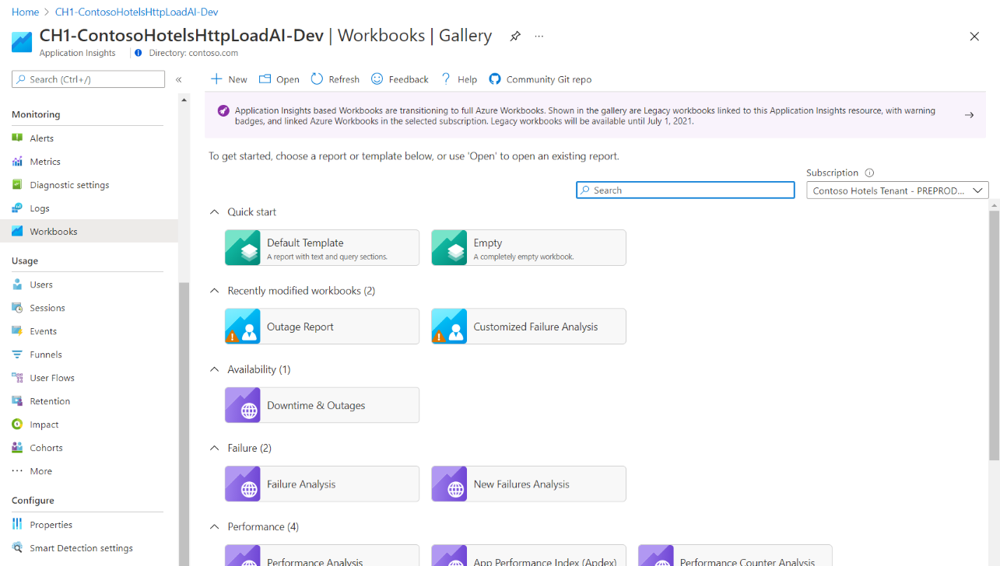

# Application Insights Workbooks Conversion
For historical reasons, Application Insights Workbooks (hereby referred as "Legacy Workbooks") are stored as a different Azure resource type than all other Azure Workbooks. We are merging these different Azure resource types and making one single standard type. This will allow it to take advantage of all the existing and new functionality available in standard Azure Workbooks. For example:

* Converted Legacy Workbooks can be queried via Azure Resource Graph (ARG), and show up in other standard Azure views of resources in a Resource Group or Subscription
* Converted Legacy Workbooks can support top level ARM features like other resource types, including but not limited to
    * Tags
    * Policies
    * Activity Log / Change Tracking
    * Resource locks
* Converted Legacy Workbooks can support [ARM templates](../Programmatically.md) 
* Converted Legacy Workbooks can support "Bring your own storage" [(BYOS)](../BYOS/BringYourOwnStorage.md) feature
* Converted Legacy Workbooks can be saved in region of your choice

## How does this impact me? 
Legacy Workbooks will be available in the Azure Portal until June 30, 2021. 

To continue using your Legacy Workbooks after June 30 2021 you will need to create a copy before June 30 2021 by using `Save as`. This will require you to select a subscription, resource group, and region where you have write access.

This will not change where you *find* your workbooks in the Azure Portal (they will still be visible under Application Insights / Workbooks) and will not affect the *content* of your workbook. Any new workbook you create hereafter will be standard Workbooks.

## Things to remember 

1. You'll be able to update (edit and save) existing Legacy Workbooks until April 15 2021 as usual. After April 15 2021, it will not be possible to save Legacy workbooks and you will need to use `Save as` to save your changes as a standard Workbook
2. Any new workbook you create will be a standard Workbook.
3. Using `Save as` on Legacy Workbook will create a standard Workbook

## How should I proceed?
1. Identify Legacy Workbooks
    * One of the easiest ways is to identify a legacy workbook is by the icon on the gallery view. Legacy workbooks will show a warning icon, Azure workbooks will not show a warning icon. 

        
    
    * Opening of Legacy Workbooks will also show a banner 

        
    
2. Convert Legacy Workbooks

    * For any legacy workbook you want to keep after June 30 2021,

        1. Open the workbook, from the toolbar select `Edit`, then `Save As`. 
        2. Enter workbook name 
        3. Select a subscription, resource group, and region where you have write access.

    * If the Legacy Workbook uses links to other Legacy Workbooks, or loading workbook content in groups, those items will need to be updated to point to the newly saved workbook.

    * After using save as, you can delete the Legacy Workbook, or update its contents to be a link to the newly saved Workbook.

## Why isn't there an automatic conversion?
1. The write permissions for legacy workbooks are only based on Azure role based access control on the Application Insights resource itself. A user may not be allowed to create new workbooks in that resource group, so if they were auto migrated, they could fail to be moved, OR they could be created but then a user might not be able to delete them after the fact.
2. Legacy workbooks support "My" (private) workbooks, which has been phased out of Azure Workbooks. A migration would cause those private workbooks to become publicly visible to users with read access to that same resource group.
3. Usage of links/group content loaded from saved Legacy workbooks would become broken. Authors will need to manually update these links to point to the new saved items.

For these reasons, we suggest that users manually migrate the workbooks they want to keep.

## What happens if I do not convert Legacy workbooks?
Starting July 1 2021 you will not see your Legacy Workbooks in Azure Portal. 

You will still be able to retrieve the content of Legacy Workbooks for another 30 days (until July 31 2021) by using Azure CLI or PowerShell tools, to query `microsoft.insights/components/[name]/favorites` for the specific resource using `api-version=2015-05-01`. 

## What if I *need* to temporarily save change to a Legacy Workbook
To revert to the previous behavior of Legacy Workbooks, you can use the setting `feature.legacyWorkbooks=true` on the Azure Portal Url, like `https://portal.azure.com/?feature.legacyWorkbooks=true`, adjusting for your portal environment and any other flags you may have set. This feature will be removed in the future but is provided temporarily if needed.